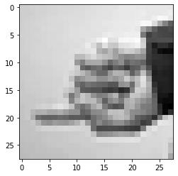

# ASL_sign_language_clustering

Hi, welcome to our COGS 118b W22 group project, made by Emmanuel, Jamie, Jason, Matilda, Noel, and Robert. In this project, we decided to preform unsupervised learning algorithems (PCA and K-Means Clustering) on ASL Sign Language dataset from MNIST, found on Kaggle [Link: www.kaggle.com/datamunge/sign-language-mnist].

### Report:
Please reference:

### Video: 
Please reference:

### Slideshow: 
Please reference:

### Dataset:
Please reference: sign_mnist_train.csv.zip
This dataset is obtained from https://www.kaggle.com/datamunge/sign-language-mnist?select=sign_mnist_train
